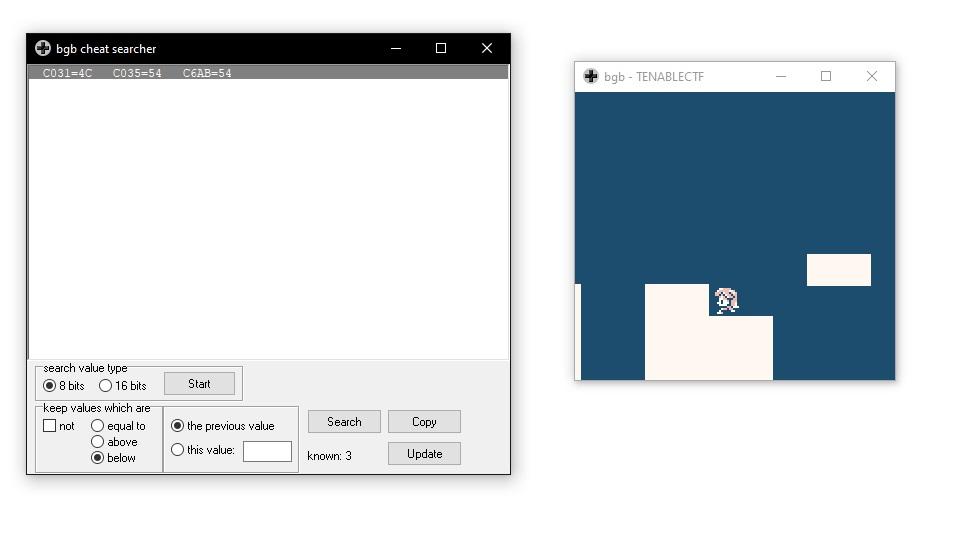
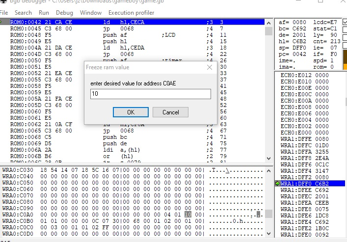
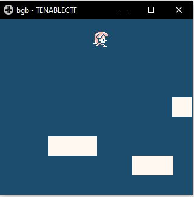
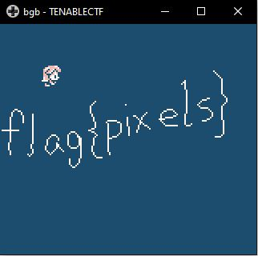

# Play Me - 200 (Vidya)

For this challenge we are presented with a gameboy rom, and the objective is to win the game to get the flag.

I used the BGB gameboy emulator to run the game. It allows me to modify ram during gameplay. 
Using the cheat searcher, I try to find the ram address responsible for the characters y axis, so that I can make the character hover in the sky.

This is done by playing the character at different heights, and then using the cheat searcher to find the appropriate ram address.

Three addresses appeared which I figured was storing the height of the character. However, upon looking at the addresses in the debugger, it was evident that the addresses are not what I was looking for.

However, I saw an address, at C0AE, that increases as the characted jumped, and decreases when my character falls. So, I decided to freeze the address with the value of 10.

Now, I am able to hover across the whole game.

Flag is displayed upon reaching the end of the map.

